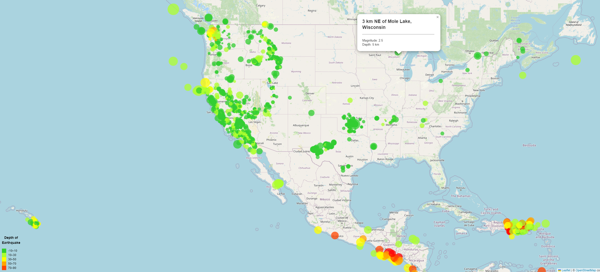

<h3>Leaflet-Challenge</h3>

<h5>Code Location and Related</h5>

> The Leaflet-Challenge skeletal program can be found by navigating to the "static/js" folder and then selecting the "logic.js" file
>
> 

<h5>Modules Utilized</h5>

> Javascript, D3, Leaflet, HTML, CSS
> 

<h5>Code source and Usage:</h5>

> Credit: Tasha Christensen
>
> Usage: Educational purposes only
>
> Dataset created by the [United States Geological Survey](https://earthquake.usgs.gov/earthquakes/feed/v1.0/geojson.php)
> 

<h5>Features and Tests</h5>

> Leaflet-Challenge provides an interactive map containing information about Earthquakes occuring in the last 30 days
> 

<h5>Contact:</h5>

If there are any questions or concerns, I can be reached at:
> [github: elasmo4](https://github.com/elasmo4)
>
> [email: tasha.christensen44@gmail.com](mailto:tasha.christensen44@gmail.com)
